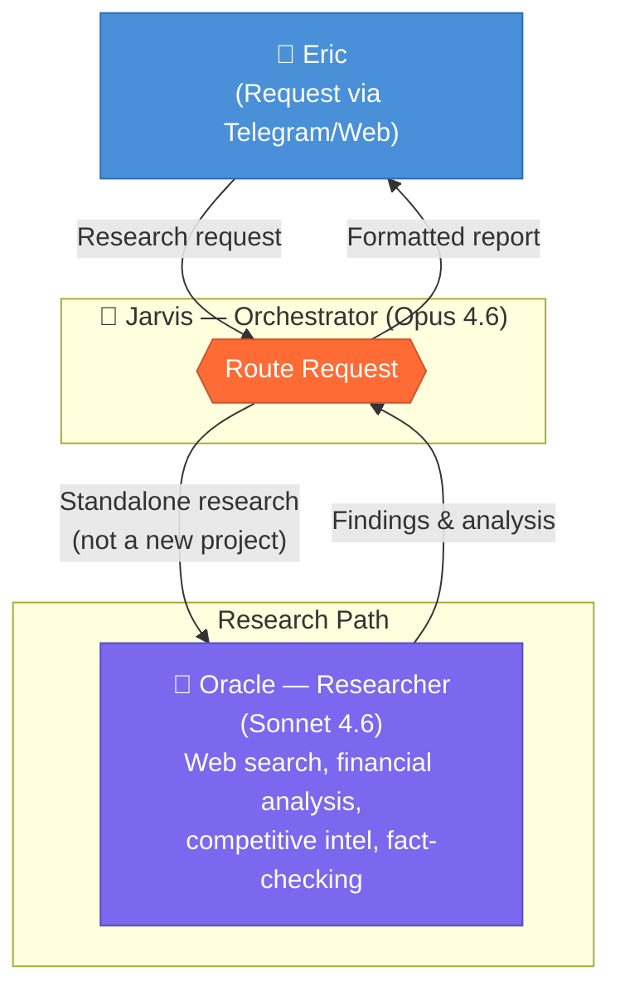
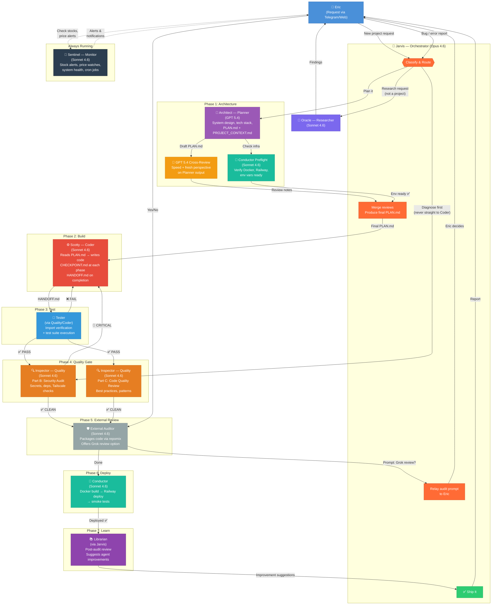

# Jarvis Agent Pipeline — How All 8 Agents Work Together

## Research Workflow

## Code Pipeline (New Project, End-to-End)

## Agent Roster Summary

| # | Agent | Identity | Model | Role |
|---|-------|----------|-------|------|
| 1 | **Jarvis** (main) | 🤖 Jarvis | Opus 4.6 | Orchestrator — routes all requests, merges reviews, relays to Eric |
| 2 | **Researcher** | 🔬 Oracle | Sonnet 4.6 | Web research, financial analysis, competitive intel |
| 3 | **Planner** | 📐 Architect | GPT 5.4 | System architecture, PLAN.md creation, tech stack decisions |
| 4 | **Coder** | ⚙️ Scotty | Sonnet 4.6 | Implementation — reads PLAN.md, writes code, checkpoints |
| 5 | **Quality** | 🔍 Inspector | Sonnet 4.6 | Security audits, code quality, error diagnosis |
| 6 | **Auditor** | 🛡️ External Auditor | Sonnet 4.6 | Final review gate, repomix packaging, Grok review option |
| 7 | **Conductor** | 🚂 Conductor | Sonnet 4.6 | Infrastructure — Docker builds, Railway deploys, smoke tests |
| 8 | **Monitor** | 📡 Sentinel | Sonnet 4.6 | Background — stock alerts, price watches, system health |

## Key Rules

- **Errors always go to Quality first** — never straight to Coder
- **New projects always go to Planner first** — never straight to Coder
- **Every code task gets a Security Audit** (Quality Part B) before shipping
- **Planner output gets dual-model review** (GPT 5.4 cross-review)
- **Jarvis orchestrates everything** — Eric only needs to make the request and approve the Grok review prompt
