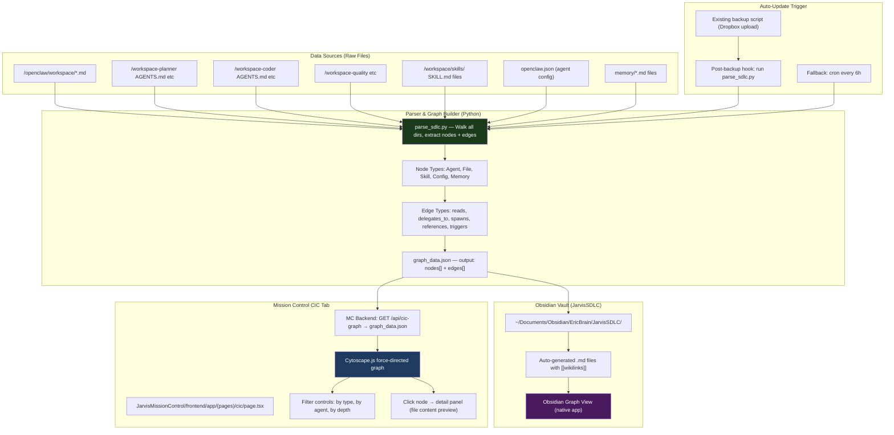
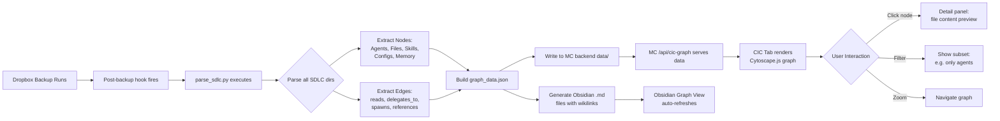
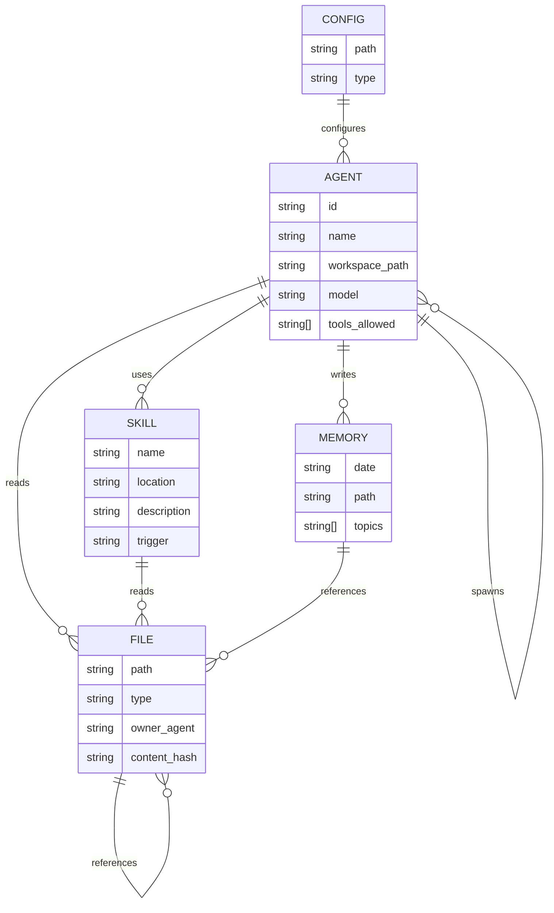
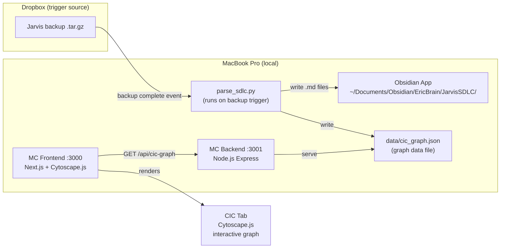
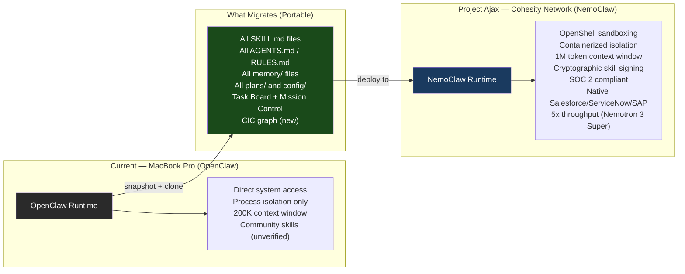
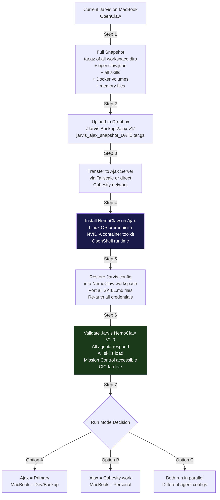
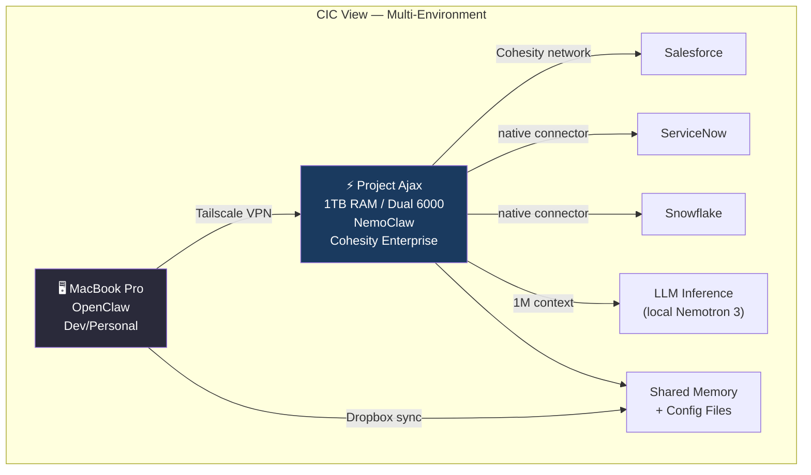

# PLAN.md — CIC: Command Information Center
**Created:** 2026-04-12 | **Status:** Draft v1 | **Drafted by:** Jarvis (Opus 4.6) | **Priority:** Critical — V1 target: this morning

---

## Overview

Build a **Command Information Center (CIC)** — a live, auto-updating graphical map of the entire Jarvis SDLC ecosystem. Every agent, config file, skill, memory file, and inter-process relationship is visualized as an interactive force-directed entity graph, rendered as a new **CIC tab inside Mission Control**. Auto-updates whenever a Jarvis backup is run to Dropbox.

The analogy: this is the digital equivalent of a US Navy warship's Combat Information Center — a single display that shows the complete operational picture of all systems, their health, and how they interconnect.

---

## System Architecture

---

## Process Flow — From Backup to CIC Display

---

## Entity Relationship — SDLC Node Types

---

## Deployment Architecture

---

## Deployment Notes
- **Runtime:** Local MacBook Pro only (no Railway needed for V1)
- **Parser:** Python 3.12 script, no new dependencies beyond `pathlib`, `json`, `re`
- **Frontend graph library:** Cytoscape.js (already in npm ecosystem, ~500KB, perfect for this scale)
- **MC Backend:** add one new endpoint `GET /api/cic-graph` serving `data/cic_graph.json`
- **MC Frontend:** new page at `(pages)/cic/page.tsx` + new Sidebar entry

---

## Node & Edge Taxonomy

### Node Types (color-coded in graph)
| Type | Color | Examples |
|------|-------|---------|
| `agent` | 🔵 Blue | jarvis, planner, coder, quality, auditor, conductor, monitor, researcher |
| `file` | ⚪ White | AGENTS.md, PIPELINE.md, DELEGATION.md, SOUL.md |
| `skill` | 🟣 Purple | railway-deployment, monitor, obsidian, github, gog |
| `config` | 🟡 Yellow | openclaw.json, mcporter.json |
| `memory` | 🟢 Green | memory/2026-04-12.md, MEMORY.md, incidents.jsonl |
| `plan` | 🟠 Orange | plans/*.md, PLAN.md files |
| `script` | 🔴 Red | scripts/*.sh, scripts/*.py |

### Edge Types (line styles)
| Type | Style | Meaning |
|------|-------|---------|
| `reads` | Solid thin | Agent reads this file on startup |
| `delegates_to` | Dashed arrow | Agent hands work to another agent |
| `spawns` | Bold arrow | Agent spawns subagent session |
| `references` | Dotted | File references another file |
| `configures` | Double line | Config file controls agent behavior |
| `triggers` | Lightning bolt | Event/cron triggers agent |
| `writes` | Solid + dot | Agent writes to this file |

---

## Phase Breakdown

### Phase 1: Parser Script (parse_sdlc.py) — 45 min
**Owner:** Coder | **Host:** MacBook

- [ ] **Task 1.1** — Walk all SDLC directories and extract nodes
  - Scan: `~/.openclaw/workspace/`, `~/.openclaw/workspace-*/`, `~/.openclaw/workspace/skills/`
  - Parse: `openclaw.json` for agent list, tools, models
  - For each `.md` file: extract title, type (from path pattern), owner agent
  - Output: `nodes[]` array with `{id, label, type, path, metadata}`

- [ ] **Task 1.2** — Extract edges from file content
  - Parse `DELEGATION.md` → agent-to-agent `delegates_to` / `spawns` edges
  - Parse each `AGENTS.md` → `reads` edges (FILES_TO_READ sections)
  - Parse `openclaw.json` `allowAgents` → `spawns` edges
  - Regex: find `[[wikilinks]]` and `file_path` patterns in all .md files
  - Output: `edges[]` array with `{source, target, type, label}`

- [ ] **Task 1.3** — Write outputs
  - Write `~/JarvisMissionControl/backend/data/cic_graph.json`
  - Write individual `.md` files to `~/Documents/Obsidian/EricBrain/JarvisSDLC/` with proper wikilinks
  - Write `cic_graph_meta.json` (last_updated, node_count, edge_count, parse_duration)

- **Acceptance criteria:** `python3 parse_sdlc.py --dry-run` prints node/edge counts; `cic_graph.json` is valid JSON with >20 nodes and >15 edges

### Phase 2: MC Backend API — 20 min
**Owner:** Coder | **Host:** MacBook

- [ ] **Task 2.1** — Add `GET /api/cic-graph` to `backend/server.js`
  - Serve `data/cic_graph.json` with CORS headers
  - Include `meta` field: last_updated, node_count, edge_count
  - Add `POST /api/cic-graph/refresh` endpoint that runs `parse_sdlc.py`

- **Acceptance criteria:** `curl http://localhost:3001/api/cic-graph` returns JSON with `nodes` and `edges` arrays

### Phase 3: CIC Frontend Page — 60 min
**Owner:** Coder | **Host:** MacBook

- [ ] **Task 3.1** — Install Cytoscape.js
  - `npm install cytoscape` in frontend
  - `npm install cytoscape-cose-bilkent` (best layout for this type of graph)

- [ ] **Task 3.2** — Create `app/(pages)/cic/page.tsx`
  - Full-screen dark canvas (matches MC glassmorphism theme)
  - Fetch `/api/cic-graph` on mount
  - Render Cytoscape.js force-directed graph
  - Node colors by type (see taxonomy above)
  - Edge styles by type
  - Click node → side panel shows: node name, type, file path, last modified, excerpt of content

- [ ] **Task 3.3** — Controls toolbar
  - Filter dropdown: All / Agents Only / Files Only / Skills Only / Memory Only
  - Search box: highlight matching nodes
  - "Refresh Graph" button: calls `/api/cic-graph/refresh`
  - "Last Updated" timestamp badge
  - Layout toggle: Force-directed / Hierarchical / Circular

- [ ] **Task 3.4** — Add CIC to Sidebar
  - Import `Radar` icon from lucide-react (naval feel)
  - Add `{ href: '/cic', icon: Radar, label: 'CIC' }` to `navItems` in `Sidebar.tsx`

- **Acceptance criteria:** `/cic` loads, graph renders with colored nodes, clicking a node shows detail panel

### Phase 4: Auto-Update Hook — 20 min
**Owner:** Jarvis (direct) | **Host:** MacBook

- [ ] **Task 4.1** — Find/create post-backup hook
  - Check existing backup script in `scripts/` for Dropbox upload call
  - Add `python3 ~/.openclaw/workspace/scripts/parse_sdlc.py` call after successful Dropbox upload
  - Fallback: add a cron job running parse every 6 hours

- [ ] **Task 4.2** — Test the trigger
  - Run backup manually, verify `cic_graph.json` timestamp updates, verify CIC tab refreshes

- **Acceptance criteria:** After backup runs, `cic_graph_meta.json` shows updated timestamp; CIC tab shows new graph within 30s

---

## V1 Scope (this morning) vs V2 Later

### V1 — Ship Today
- ✅ Parser script that walks SDLC dirs and generates graph_data.json
- ✅ MC backend endpoint serving graph data
- ✅ CIC tab with interactive Cytoscape.js graph
- ✅ Node coloring by type, edge type differentiation
- ✅ Click-to-inspect node detail panel
- ✅ Obsidian vault files auto-generated (bonus: native Obsidian graph view also works)
- ✅ Manual "Refresh" button in CIC tab
- ✅ Post-backup auto-trigger

### V2 — Future
- Live update via WebSocket (no manual refresh needed)
- Diff view: "what changed since last backup"
- Agent health overlay (green/red nodes based on last run status)
- Time-slider: replay how the SDLC evolved over time
- Click edge → show the actual code/text that creates the relationship
- "Pathfinder": highlight all paths between two nodes

---

## Risk Assessment

| Risk | Likelihood | Impact | Mitigation |
|------|-----------|--------|------------|
| Cytoscape.js SSR issues in Next.js | Medium | High | Use `dynamic(() => import(...), { ssr: false })` |
| Parser misses some edge types | Low | Medium | Start with high-confidence edges (openclaw.json, DELEGATION.md); expand in V2 |
| Too many nodes = performance | Low | Medium | Cap at 200 nodes for V1; filter memory/ files to recent only |
| Obsidian vault conflicts with existing notes | Low | Low | Write to a dedicated `/JarvisSDLC/` subfolder only |
| MC backend restart needed after adding endpoint | Low | Low | `pm2 restart` or `node server.js` restart after edit |

---

## Success Criteria (V1 Complete)
- [ ] CIC tab appears in Mission Control sidebar with Radar icon
- [ ] Graph renders with ≥20 nodes, ≥15 edges on first load
- [ ] At least 7 agent nodes visible (jarvis, planner, coder, quality, auditor, conductor, monitor)
- [ ] Click any node → detail panel shows file path and content excerpt
- [ ] Filter by "Agents Only" shows only agent nodes
- [ ] "Refresh" button updates the graph
- [ ] Obsidian vault `/JarvisSDLC/` folder populated with linked .md files
- [ ] Post-backup trigger confirmed working (cic_graph_meta.json timestamp updates)

---

## Adversarial Review (Grok 4.20 Beta)
*[To be added after first draft — skipped for speed given V1 morning target]*
**Review skipped:** Time-constrained V1. Ship, then review for V2 scope.

---

## Questions for Eric (before we start coding)

**1 question before we dive in:**

> **Obsidian vault:** Should the auto-generated JarvisSDLC files go into your existing **EricBrain** vault (`~/Documents/Obsidian/EricBrain/JarvisSDLC/`) or into a **new dedicated vault** (`~/Documents/Obsidian/JarvisSDLC/`)?
>
> - **EricBrain (existing):** The SDLC graph nodes will appear connected to your other notes (Andrej, Pipeline, etc.) in graph view — richer but noisier
> - **New vault (dedicated):** Clean separation — only SDLC entities, cleaner graph, easier to read
>
> My recommendation: **EricBrain with a dedicated `/JarvisSDLC/` subfolder** — best of both worlds. You get the SDLC graph in its own section AND it can still cross-link to your strategy/meeting notes.

Once you confirm, I'll start Phase 1 immediately.

---

## Phase 5: Project Ajax — Jarvis NemoClaw Migration (Added 2026-04-12)

### Background
Eric has ordered a dedicated high-performance AI server for deployment inside the Cohesity network:
- **Hardware:** 1TB total RAM, dual NVIDIA 6000-series GPUs
- **Platform:** NemoClaw (NVIDIA's enterprise AI agent framework, built on top of OpenClaw)
- **Codename:** **Project Ajax** — named after HMS Ajax, the British cruiser famous for the Battle of the River Plate (1939), where she and HMS Exeter crippled the German pocket battleship *Admiral Graf Spee*. Ajax = power, precision, and decisive action.
- **Purpose:** Production-grade Jarvis instance with enterprise security, SOC 2 compliance, and 5x throughput

### OpenClaw vs NemoClaw: What Changes on Ajax

### Migration Architecture

### CIC Integration for Ajax
The CIC graph will show BOTH environments once Ajax is live:

### Ajax Phase Breakdown

| Step | What | Owner | When |
|------|------|-------|------|
| 5.1 | Research NemoClaw install requirements (Linux distro, NVIDIA drivers, OpenShell setup) | Researcher Agent | After Ajax hardware arrives |
| 5.2 | Build comprehensive Jarvis snapshot script (enhanced backup) | Coder | Can start now |
| 5.3 | Install NemoClaw + validate GPU/RAM detection | Jarvis on Ajax | Hardware arrival day |
| 5.4 | Port all SKILL.md + config to NemoClaw workspace format | Coder | Day 2 on Ajax |
| 5.5 | Re-auth all credentials (Google OAuth, Anthropic, GitHub, Telegram, Dropbox) | Jarvis | Day 2 on Ajax |
| 5.6 | Deploy Mission Control + CIC tab on Ajax | Coder | Day 2 on Ajax |
| 5.7 | Add Ajax as second environment in CIC graph | Coder | Day 3 |
| 5.8 | Decide run mode (primary vs parallel vs Cohesity-only) | Eric | Day 3 |

### What We Can Do NOW (Before Ajax Arrives)

1. **Enhance the backup script** — make `parse_sdlc.py` also produce a NemoClaw-compatible manifest of all skills and config, so migration day is just "restore + re-auth"
2. **Research NemoClaw installation** — exact Linux distro, Docker/container requirements, OpenShell setup procedure
3. **Design the dual-environment CIC** — CIC graph already supports multi-environment nodes (see taxonomy above — add `environment` attribute to each node)
4. **Tag all current skills as "verified portable"** — audit which skills are platform-agnostic vs MacBook-specific (e.g., `voice-call` uses Tailscale Funnel — needs re-config on Ajax)

### Key Questions for Eric

1. **What Linux distro will Ajax run?** (Ubuntu 22.04/24.04 is recommended for NemoClaw; Debian also works)
2. **Will Ajax be on a static Cohesity IP or accessible via Tailscale?** (Tailscale preferred for seamless connectivity from MacBook)
3. **Run mode preference:** Ajax as primary production instance, or MacBook stays primary with Ajax as the enterprise-Cohesity instance?
4. **NemoClaw license:** NVIDIA enterprise license required for full SOC 2 features — do you have this through Cohesity's NVIDIA relationship?
