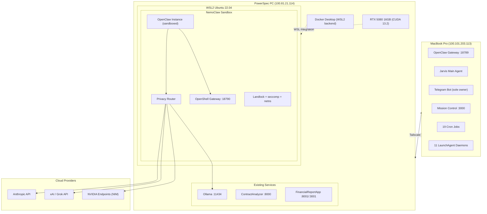

# Project NemoClaw PowerSpec Prototype — Implementation Plan

**Date:** 2026-04-12
**Author:** Planner Agent (Jarvis)
**Status:** ✅ Auditor Approved + Scope Refined (2026-04-12 19:48 PDT) — Google removed, Cohesity G Drive added, final skill/cron decisions locked
**Based on:** [Research Report](nemoclaw-powerspec-research.md)

---

## Executive Summary

This plan deploys NemoClaw (NVIDIA's security-sandboxed OpenClaw wrapper) on the PowerSpec PC as a working Jarvis prototype. The MacBook OpenClaw instance remains untouched — this is a parallel sandbox environment for evaluation before the Ajax server arrives.

**Key decisions made:**
- PowerSpec NemoClaw gateway runs on **port 18790** (Mac keeps 18789)
- Telegram stays on Mac — PowerSpec prototype uses **TUI/CLI only** (no bot token conflict)
- Google OAuth is **deferred** — too complex for WSL2 prototype; Gmail/Calendar skills run Mac-only
- **All Google Workspace services removed** from NemoClaw scope (gog, google-oauth-reauth, tax-automation)
- **File storage:** Cohesity Google Drive (Eric.brown@cohesity.com) replaces personal Dropbox for NemoClaw outputs
- **Crons removed:** Daily 6 AM Briefing, Daily Tax Email Scan, Daily Subscription Monitor, Weekly Background Info Update, clawdbot-data-refresh, Auth Health Check (all Google/personal-dependent)
- **Skills removed:** gog, google-oauth-reauth, tax-automation, blucli, peekaboo, tailscale-troubleshooting, remote-coder, linkedin-carousel
- **Skills kept (including Cohesity analytics):** financial-report-gen ✅, earnings-analyzer ✅
- 19 skills migrate immediately (down from 20 — linkedin-carousel dropped), 9 skipped total
- Mission Control stays on Mac — PowerSpec accesses it via Tailscale at `100.101.203.113:3000`

**Estimated total time:** 2.5–4 hours across all phases

---

## Architecture

### System Topology



### Port Allocation (PowerSpec)

| Port | Service | Owner | NemoClaw Impact |
|------|---------|-------|-----------------|
| 3001 | FinancialReportApp Frontend | Docker | No conflict |
| 5432 | ContractAnalyzer Postgres | Docker | No conflict |
| 5433 | FinancialReportApp Postgres | Docker | No conflict |
| 6379 | ContractAnalyzer Redis | Docker | No conflict |
| 6380 | FinancialReportApp Redis | Docker | No conflict |
| 8000 | ContractAnalyzer API | Docker | No conflict |
| 8001 | FinancialReportApp API | Docker | No conflict |
| 9000–9001 | MinIO (ContractAnalyzer) | Docker | No conflict |
| 11434 | Ollama | Native Windows | **Shared** — NemoClaw routes inference here |
| **18789** | **RESERVED — Mac OpenClaw** | Mac (via Tailscale) | **DO NOT USE** |
| **18790** | **NemoClaw Gateway** | NemoClaw | ✅ New allocation |

---

## Installation Sequence

```mermaid
flowchart TD
    P0["Phase 0: Prerequisites"] --> P0a["Install Ubuntu 22.04 WSL2"]
    P0a --> P0b["Enable systemd in WSL2"]
    P0b --> P0c["Configure Docker Desktop WSL integration"]
    P0c --> P0d["Install nvidia-container-toolkit in WSL2"]
    P0d --> P0e["Verify: nvidia-smi works in WSL2"]
    P0e --> P0f["Get NVIDIA API key from build.nvidia.com"]

    P0f --> P1["Phase 1: NemoClaw Install (Eric)"]
    P1 --> P1a["Run NemoClaw installer in WSL2 Ubuntu"]
    P1a --> P1b["Onboard wizard: select Anthropic provider"]
    P1b --> P1c["Configure gateway port to 18790"]
    P1c --> P1d["Verify NemoClaw TUI launches"]

    P1d --> P2["Phase 2: Workspace Migration (Jarvis)"]
    P2 --> P2a["Copy workspace files via SCP/rsync"]
    P2a --> P2b["Import 19 portable skills"]
    P2b --> P2c["Configure API credentials on host"]
    P2c --> P2d["Set network policy allowlists"]
    P2d --> P2e["Configure Ollama as local provider"]

    P2e --> P3["Phase 3: Validation"]
    P3 --> P3a["Test agent responses via TUI"]
    P3a --> P3b["Test skill execution (5 key skills)"]
    P3b --> P3c["Test GPU inference via Ollama"]
    P3c --> P3d["Test Mission Control access"]
    P3d --> P3e["Run security sandbox validation"]
    P3e --> P3f["✅ Prototype Complete"]
```



---

## Phase 0: Prerequisites

**Estimated time: 30–45 minutes**
**Who: Eric (manual steps on PowerSpec)**

### Step 0.1 — Install Ubuntu 22.04 WSL2 Distro

Open PowerShell as Administrator on PowerSpec:

```powershell
# Check current WSL distros
wsl --list --verbose

# Install Ubuntu 22.04
wsl --install -d Ubuntu-22.04

# Verify it's running WSL2 (not WSL1)
wsl --list --verbose
# Should show:  Ubuntu-22.04    Running    2
```

Set up a username/password when prompted (e.g., `jarvis` / strong password).

> **If `wsl --install` fails:** PowerSpec already runs WSL2 for Docker Desktop, so the required Windows features should already be enabled. If the command fails anyway, run:
> ```powershell
> dism.exe /online /enable-feature /featurename:Microsoft-Windows-Subsystem-Linux /all /norestart
> dism.exe /online /enable-feature /featurename:VirtualMachinePlatform /all /norestart
> # Reboot, then retry: wsl --install -d Ubuntu-22.04
> ```

### Step 0.2 — Enable systemd in WSL2

From inside the new Ubuntu 22.04 shell (`wsl -d Ubuntu-22.04`):

```bash
sudo tee /etc/wsl.conf << 'EOF'
[boot]
systemd=true

[interop]
enabled=true
appendWindowsPath=true
EOF
```

Then restart WSL from PowerShell:

```powershell
wsl --shutdown
wsl -d Ubuntu-22.04
```

Verify systemd is running:

```bash
systemctl --no-pager status
# Should show "State: running"
```

### Step 0.3 — Configure Docker Desktop WSL Integration

1. Open **Docker Desktop** on Windows
2. Go to **Settings → Resources → WSL Integration**
3. Enable integration for **Ubuntu-22.04** (toggle ON)
4. Click **Apply & restart**

Verify from WSL2 Ubuntu:

```bash
docker --version
# Should show: Docker version 29.3.1 or similar

docker run --rm hello-world
# Should succeed
```

### Step 0.4 — Install NVIDIA Container Toolkit in WSL2

**Important:** Do NOT install the NVIDIA Linux driver inside WSL2. The Windows driver handles GPU passthrough. Only install the container toolkit.

From WSL2 Ubuntu:

```bash
# Add NVIDIA container toolkit repo
curl -fsSL https://nvidia.github.io/libnvidia-container/gpgkey | \
  sudo gpg --dearmor -o /usr/share/keyrings/nvidia-container-toolkit-keyring.gpg

curl -s -L https://nvidia.github.io/libnvidia-container/stable/deb/nvidia-container-toolkit.list | \
  sed 's#deb https://#deb [signed-by=/usr/share/keyrings/nvidia-container-toolkit-keyring.gpg] https://#g' | \
  sudo tee /etc/apt/sources.list.d/nvidia-container-toolkit.list

sudo apt-get update
sudo apt-get install -y nvidia-container-toolkit

# Configure Docker to use NVIDIA runtime
sudo nvidia-ctk runtime configure --runtime=docker
```

Restart Docker Desktop (from Windows side), then verify GPU access:

```bash
# Must show RTX 5080
nvidia-smi

# Must succeed — shows GPU inside container
docker run --rm --gpus all nvidia/cuda:12.6.0-base-ubuntu22.04 nvidia-smi
```

**If `nvidia-smi` fails:** The Windows NVIDIA driver version must be 535.86.05+ for WSL2 GPU passthrough. PowerSpec has driver 32.0.15.9597 (much newer) so this should work. If it doesn't, restart WSL (`wsl --shutdown`) and retry.

### Step 0.5 — Configure WSL2 Memory Limits

Create/edit `C:\Users\Eric Brown\.wslconfig`:

```ini
[wsl2]
memory=64GB
swap=16GB
processors=16
localhostForwarding=true
```

This caps WSL2 at 64GB (half of 128GB), leaving plenty for Windows Docker services and Ollama. Restart WSL after:

```powershell
wsl --shutdown
wsl -d Ubuntu-22.04
```

### Step 0.6 — Get NVIDIA API Key

1. Go to [build.nvidia.com](https://build.nvidia.com)
2. Sign in (or create NVIDIA Developer account)
3. Navigate to any model page → click **"Get API Key"**
4. Copy the key — starts with `nvapi-...`
5. Save it somewhere safe — needed during NemoClaw onboarding

---

## Phase 1: NemoClaw Installation

**Estimated time: 20–30 minutes**
**Who: Eric (runs installer himself)**

### Step 1.1 — Run the NemoClaw Installer

From WSL2 Ubuntu 22.04:

> ⚠️ **Verify the current installer URL** at [NVIDIA NemoClaw GitHub](https://github.com/NVIDIA/NemoClaw) before running — the URL below may have changed. Use whatever the official README specifies.

```bash
curl -fsSL https://nvidia.com/nemoclaw.sh | bash
```

This downloads the NemoClaw bootstrap, installs the OpenShell runtime, and launches the onboarding wizard.

### Step 1.2 — Onboarding Wizard Settings

When `nemoclaw onboard` launches, use these settings:

| Wizard Prompt | Recommended Value | Why |
|--------------|-------------------|-----|
| Inference provider | **Anthropic** | Existing API key, proven quality for Jarvis |
| Anthropic API key | *(paste existing key)* | Same key as Mac — Anthropic allows multi-device |
| NVIDIA API key | *(paste nvapi-... key from Step 0.6)* | Required for NIM model catalog access |
| Enable local inference? | **Yes** | We'll connect to existing Ollama on :11434 |
| Gateway port | **18790** | ⚠️ CRITICAL — must NOT be 18789 (Mac conflict) |
| Network policy | **Permissive (prototype)** | Start open, tighten later |
| Enable Telegram? | **No / Skip** | Mac owns the bot token — prototype uses TUI only |

### Step 1.3 — Verify NemoClaw Launched

```bash
# Check NemoClaw status
nemoclaw status

# Should show:
# - OpenShell: running
# - Gateway: listening on :18790
# - Sandbox: active
# - GPU: detected (RTX 5080)

# Open TUI
nemoclaw tui
# Should show an interactive chat interface
```

### Step 1.4 — Change Gateway Port (if wizard didn't offer it)

If the wizard defaulted to 18789, change it manually:

```bash
# Find the NemoClaw config
nemoclaw config show

# Edit gateway port
nemoclaw config set gateway.port 18790

# Restart
nemoclaw restart
```

Or edit the OpenClaw config inside the sandbox directly:

```bash
# Path varies — check nemoclaw config show for sandbox root
# Typically: ~/.nemoclaw/sandbox/openclaw.json or similar
# Set: "gateway": { "port": 18790 }
```

Verify:

```bash
curl -s http://localhost:18790/health
# Should return 200 OK or JSON health response
```

---

## Phase 2: Workspace Migration

**Estimated time: 45–90 minutes**
**Who: Jarvis (automated via SSH from MacBook)**

### Step 2.1 — Prepare Migration Bundle on MacBook

```bash
# On MacBook — create a migration tarball
cd /Users/ericbrown/.openclaw/workspace

# Create migration bundle (excludes node_modules, logs, temp files)
tar czf /tmp/jarvis-nemoclaw-migration.tar.gz \
  --exclude='node_modules' \
  --exclude='*.log' \
  --exclude='.git' \
  --exclude='logs/' \
  --exclude='pipeline-outputs/' \
  AGENTS.md \
  SOUL.md \
  IDENTITY.md \
  USER.md \
  TOOLS.md \
  DELEGATION.md \
  DISPATCH_TEMPLATE.md \
  AUTH_FALLBACKS.md \
  PIPELINE.md \
  POWERSPEC.md \
  INCIDENTS.md \
  KNOWN_FAILURES.md \
  MEMORY.md \
  memory/ \
  plans/ \
  tasks/ \
  skills/afrexai-contract-analyzer/ \
  skills/ai-legal-assistant/ \
  skills/auditor/ \
  skills/autoClaw/ \
  skills/blogwatcher/ \
  skills/cohesity-domain/ \
  skills/competitive-intel/ \
  skills/firecrawl/ \
  skills/librarian/ \
  skills/project-dynamo/ \
  skills/ragflow-search/ \
  skills/railway-deployment/ \
  skills/salesforce-analytics/ \
  skills/slack-teams-hub/ \
  skills/snowflake-sql/ \
  skills/workday-analytics/ \
  skills/earnings-analyzer/ \
  skills/financial-report-gen/ \
  skills/remote-coder/ \
  skills/monitor/ \
  skills/mc-snapshot/ \
  skills/tax-automation/ \
  skills/gog/

echo "Migration bundle size:"
ls -lh /tmp/jarvis-nemoclaw-migration.tar.gz
```

### Step 2.2 — Transfer to PowerSpec

```bash
# SCP to PowerSpec via Tailscale
scp /tmp/jarvis-nemoclaw-migration.tar.gz \
  "Eric Brown@100.81.21.114:C:/Users/Eric Brown/Desktop/jarvis-nemoclaw-migration.tar.gz"
```

Then from WSL2 Ubuntu on PowerSpec (SSH or interactive):

```bash
# Find NemoClaw sandbox workspace path
SANDBOX_WS=$(nemoclaw config show | grep -i workspace | head -1)
# Likely: ~/.nemoclaw/sandbox/workspace or similar
# If unclear, check: nemoclaw config show

# For this plan, assume:
SANDBOX_WS="$HOME/.nemoclaw/sandbox/workspace"

# Copy tarball into WSL2 filesystem
cp "/mnt/c/Users/Eric Brown/Desktop/jarvis-nemoclaw-migration.tar.gz" /tmp/

# Extract into sandbox workspace
mkdir -p "$SANDBOX_WS"
tar xzf /tmp/jarvis-nemoclaw-migration.tar.gz -C "$SANDBOX_WS"

echo "Extracted to $SANDBOX_WS"
ls -la "$SANDBOX_WS"
```

### Step 2.3 — Configure Agent Definitions

The NemoClaw OpenClaw instance needs its own `openclaw.json` with agent definitions matching Mac Jarvis. Key differences from Mac config:

```jsonc
// Changes from Mac openclaw.json for NemoClaw instance:
{
  "gateway": {
    "port": 18790,        // NOT 18789
    "mode": "local"
  },
  "channels": {
    // NO Telegram — prototype uses TUI only
  },
  "models": {
    "providers": {
      "anthropic": {
        // API key configured via NemoClaw host (Privacy Router)
      },
      "xai": {
        "baseURL": "https://api.x.ai/v1"
        // API key on host
      },
      "ollama-local": {
        "baseURL": "http://localhost:11434/v1"
        // Ollama on Windows host — accessible via WSL2 localhost forwarding
      }
    }
  },
  "agents": {
    // Same 8 agents as Mac (main, researcher, planner, coder, quality, monitor, auditor, conductor)
    // Same model assignments
    // Workspace path updated to NemoClaw sandbox path
  }
}
```

The exact config method depends on NemoClaw's configuration interface — it may use `nemoclaw config set` commands or direct JSON editing. After the wizard, locate the OpenClaw config:

```bash
# Find the config file
find ~/.nemoclaw -name "openclaw.json" -o -name "config.json" 2>/dev/null

# Or check NemoClaw docs
nemoclaw config show
```

### Step 2.4 — Configure API Credentials

NemoClaw keeps API keys on the **host side** (outside the sandbox) via the Privacy Router. Configure each provider:

```bash
# Anthropic (should be set during onboard wizard)
nemoclaw config set providers.anthropic.apiKey "sk-ant-..."

# xAI / Grok
nemoclaw config set providers.xai.apiKey "xai-..."
nemoclaw config set providers.xai.baseURL "https://api.x.ai/v1"

# NVIDIA Endpoints (set during onboard)
nemoclaw config set providers.nvidia.apiKey "nvapi-..."

# Brave Search (for web search skill)
nemoclaw config set skills.brave.apiKey "BSA..."

# Google Places (for goplaces skill)
nemoclaw config set skills.goplaces.apiKey "AIza..."

# OpenAI (if using gpt-5.1-codex or other OpenAI models)
# Note: Optional for prototype — primary models are Anthropic/xAI
nemoclaw config set providers.openai.apiKey "sk-..."
nemoclaw config set providers.openai.baseURL "https://api.openai.com/v1"

# ElevenLabs TTS (optional for prototype)
nemoclaw config set talk.elevenlabs.apiKey "..."
```

**If `nemoclaw config set` doesn't support nested paths**, edit the config JSON directly.

**Deferred credentials (NOT configured for prototype):**
- ❌ Telegram bot token (Mac-only)
- ❌ Google OAuth / gog CLI tokens (too complex for WSL2 prototype)
- ❌ 1Password CLI (Mac-local tmux dependency)
- ❌ Dropbox tokens (deferred — low priority for prototype)

### Step 2.5 — Configure Ollama as Local Provider

Ollama is already running on PowerSpec Windows at `localhost:11434`. WSL2 has `localhostForwarding=true` (set in Step 0.5), so:

```bash
# From WSL2 — verify Ollama is reachable
curl -s http://localhost:11434/api/tags | head -20

# Should show available models (qwen3.5:35b-a3b, glm-4.7-flash, etc.)
```

Configure in NemoClaw's OpenClaw config as an additional provider:

> **Note on URL change:** The Mac OpenClaw config references Ollama at `http://100.81.21.114:11434/v1` (PowerSpec's Tailscale IP, accessed remotely from the Mac). NemoClaw on PowerSpec uses `http://localhost:11434/v1` because it's running locally — WSL2's `localhostForwarding=true` bridges Windows localhost into the WSL2 network.


```jsonc
{
  "ollama-local": {
    "type": "openai-compatible",
    "baseURL": "http://localhost:11434/v1",
    "models": ["qwen3.5:35b-a3b", "glm-4.7-flash"]
  }
}
```

### Step 2.6 — Configure Network Policy

NemoClaw's sandbox restricts network egress by default. Add allowlist entries for required endpoints:

```bash
# Anthropic API
nemoclaw policy allow-egress "api.anthropic.com:443"

# xAI API
nemoclaw policy allow-egress "api.x.ai:443"

# NVIDIA Endpoints
nemoclaw policy allow-egress "integrate.api.nvidia.com:443"
nemoclaw policy allow-egress "build.nvidia.com:443"

# Brave Search
nemoclaw policy allow-egress "api.search.brave.com:443"

# Google Places
nemoclaw policy allow-egress "places.googleapis.com:443"

# Ollama (local — WSL2 localhost)
nemoclaw policy allow-egress "localhost:11434"

# Mac Mission Control (via Tailscale)
nemoclaw policy allow-egress "100.101.203.113:3000"

# GitHub API (for gh CLI / coding skills)
nemoclaw policy allow-egress "api.github.com:443"
nemoclaw policy allow-egress "github.com:443"

# PowerSpec existing services (Tailscale loopback)
nemoclaw policy allow-egress "localhost:8000"
nemoclaw policy allow-egress "localhost:8001"
```

**Note:** If NemoClaw uses a different policy mechanism (e.g., YAML policy file, `openclaw.json` network section), adapt the above to its actual interface. The key is that these endpoints must be reachable from within the sandbox.

### Step 2.7 — Disable Mac-Only Skills

Remove or disable these 4 skills in the NemoClaw workspace (they won't work on Windows/WSL2):

```bash
SANDBOX_WS="$HOME/.nemoclaw/sandbox/workspace"

# Rename to .disabled (preserves files in case you need them later)
for s in blucli peekaboo tailscale-troubleshooting google-oauth-reauth; do
  mv "$SANDBOX_WS/skills/$s" "$SANDBOX_WS/skills/${s}.disabled" 2>/dev/null
done

# Verify
ls "$SANDBOX_WS/skills/" | grep ".disabled"
```

Also disable the `linkedin-carousel` skill (was in research but not in current workspace — skip if not present).

---

## Skills Portability Matrix

| # | Skill | Source | Portable? | Action for NemoClaw |
|---|-------|--------|:---------:|---------------------|
| 1 | afrexai-contract-analyzer | workspace | ✅ | Copy as-is |
| 2 | ai-legal-assistant | workspace | ✅ | Copy as-is |
| 3 | auditor | workspace | ✅ | Copy as-is |
| 4 | autoClaw | workspace | ✅ | Copy as-is |
| 5 | blogwatcher | workspace | ✅ | Copy as-is |
| 6 | cohesity-domain | workspace | ✅ | Copy as-is |
| 7 | competitive-intel | workspace | ✅ | Copy as-is |
| 8 | firecrawl | workspace | ✅ | Copy as-is (already points to PowerSpec) |
| 9 | librarian | workspace | ✅ | Copy as-is |
| 10 | project-dynamo | workspace | ✅ | Copy as-is |
| 11 | ragflow-search | workspace | ✅ | Copy as-is (already points to PowerSpec) |
| 12 | railway-deployment | workspace | ✅ | Copy as-is |
| 13 | salesforce-analytics | workspace | ✅ | Copy as-is (API-based) |
| 14 | slack-teams-hub | workspace | ✅ | Copy as-is (API-based) |
| 15 | snowflake-sql | workspace | ✅ | Copy as-is (API-based) |
| 16 | workday-analytics | workspace | ✅ | Copy as-is (API-based) |
| 17 | earnings-analyzer | workspace | ⚠️ | Copy — disable email delivery (needs gog); analysis portion works |
| 18 | financial-report-gen | workspace | ⚠️ | Copy — disable email delivery; report generation works |
| 19 | remote-coder | workspace | ⚠️ | Copy — **rewrite paths**: running ON PowerSpec, so SSH-to-self is pointless; redirect to local execution |
| 20 | monitor | workspace | ⚠️ | Copy — update Mac-specific paths (`/opt/homebrew/`, LaunchAgent refs) to Linux equivalents |
| 21 | mc-snapshot | workspace | ⚠️ | Copy — change MC URL from `localhost:3000` to `100.101.203.113:3000` |
| 22 | tax-automation | workspace | ⚠️ | Copy — defer Google Sheets integration (needs gog); document-analysis portion works |
| 23 | gog | workspace | ⚠️ | Copy — **non-functional until Google OAuth configured**; keep for reference |
| 24 | blucli | workspace | ❌ | **Skip** — BluOS speakers on Mac LAN only |
| 25 | peekaboo | workspace | ❌ | **Skip** — macOS Accessibility/AppleScript only |
| 26 | tailscale-troubleshooting | workspace | ❌ | **Skip** — Mac App Store Tailscale specific |
| 27 | google-oauth-reauth | workspace | ❌ | **Skip** — Mac-specific OAuth flow |
| 28 | linkedin-carousel | workspace | ❌ | **Skip** — not Cohesity business-relevant |

**Standard OpenClaw skills** (installed at `/opt/homebrew/lib/node_modules/openclaw/skills/` on Mac) are bundled with OpenClaw itself. NemoClaw's embedded OpenClaw will include its own copy of these standard skills (1password, apple-notes, coding-agent, gemini, gh-issues, github, goplaces, healthcheck, himalaya, nano-pdf, node-connect, obsidian, openai-whisper, skill-creator, summarize, taskflow, tmux, video-frames, voice-call, weather, etc.). No manual migration needed for standard skills.

**Summary:** 19 copy as-is | 4 skip (Mac-only) | 5 copy but partially non-functional (deferred Google/email deps) | 2 copy with path updates needed

---

## Cron Jobs Decision Matrix

| # | Cron Job | Agent | Freq | Keep on Mac | Replicate on PowerSpec | Skip | Reason |
|---|----------|-------|------|:-----------:|:---------------------:|:----:|--------|
| 1 | Monitor Sweep | monitor | 3h | ✅ | ❌ | | Mac-specific paths; Mac is production |
| 2 | Cron Delivery Self-Heal | main | 30m | ✅ | ❌ | | Telegram-dependent; PS has no Telegram |
| 3 | Auth Health Check | monitor | 4h | ✅ | ❌ | | Google OAuth — Mac only |
| 4 | Task Stall Respawner | monitor | 2h | ✅ | ✅ | | Portable — useful for PS sandbox testing |
| 5 | clawdbot-data-refresh | main | daily | ✅ | ❌ | | Low priority for prototype |
| 6 | Daily OpenClaw Doctor | monitor | 5:00 AM | ✅ | ✅ | | Valuable health check; adapt paths |
| 7 | Daily Smoke Test | monitor | 5:30 AM | ✅ | ❌ | | Mac-specific test suite |
| 8 | Daily OpenClaw Auto-Update | main | 5:45 AM | ✅ | ❌ | | NemoClaw manages its own updates |
| 9 | Daily Tax Email Scan | main | 5:45 AM | ✅ | ❌ | | Gmail-dependent |
| 10 | Daily Security Scan | main | 5:50 AM | ✅ | ❌ | | Mac-specific security tools |
| 11 | Stock Monitor | monitor | 6:00 AM | ✅ | ✅ | | Portable — web search based |
| 12 | Daily 6 AM AI Productivity | main | 6:00 AM | ✅ | ❌ | | Email delivery required |
| 13 | Daily Subscription Monitor | main | 6:10 AM | ✅ | ❌ | | Email-dependent |
| 14 | Weekly Competitor Analysis | researcher | Mon 7 AM | ✅ | ✅ | | Portable — web research |
| 15 | Weekly Claude Best Practices | auditor | Mon 7 AM | ✅ | ❌ | | Keep single source of truth on Mac |
| 16 | Anthropic Ecosystem Daily | monitor | 8:00 AM | ✅ | ❌ | | Keep single source on Mac |
| 17 | Daily Vibe Coding Security | auditor | 8:00 AM | ✅ | ❌ | | Mac codebase audit |
| 18 | Weekly Background Infra | main | Mon 9 AM | ✅ | ❌ | | Infrastructure-dependent |

**Summary for PowerSpec NemoClaw:** Replicate **4 crons** (Task Stall Respawner, Daily Doctor, Stock Monitor, Weekly Competitor Analysis). Keep the other **14 on Mac only**. This avoids duplicate alerts, duplicate email sends, and conflict with Mac-only dependencies.

**Important:** Do NOT replicate any email-sending or Telegram-notifying crons on PowerSpec. The prototype has no outbound messaging channel.

---

## Phase 3: Validation

**Estimated time: 30–60 minutes**
**Who: Jarvis (automated) + Eric (spot checks)**

### Testing Checklist

| # | Test | Command / Action | Expected Result | Pass? |
|---|------|-----------------|-----------------|:-----:|
| 1 | NemoClaw status | `nemoclaw status` | All components: running | ☐ |
| 2 | Gateway health | `curl http://localhost:18790/health` | 200 OK | ☐ |
| 3 | GPU detected | `nvidia-smi` (inside WSL2) | RTX 5080, 16GB | ☐ |
| 4 | GPU in Docker | `docker run --rm --gpus all nvidia/cuda:12.6.0-base-ubuntu22.04 nvidia-smi` | RTX 5080 visible | ☐ |
| 5 | Ollama reachable | `curl http://localhost:11434/api/tags` | Model list returned | ☐ |
| 6 | TUI chat works | `nemoclaw tui` → type "Hello, what's your name?" | Agent responds as Jarvis | ☐ |
| 7 | Anthropic inference | TUI → "What is 2+2? Reply in one word." | "Four" (confirms cloud API works) | ☐ |
| 8 | Local inference | TUI → switch to Ollama model → "What is 2+2?" | Response from local model | ☐ |
| 9 | Workspace files | `ls $SANDBOX_WS/SOUL.md $SANDBOX_WS/USER.md` | Files present | ☐ |
| 10 | Skills loaded | `nemoclaw tui` → "List your available skills" | Shows 19+ portable skills | ☐ |
| 11 | Web search skill | TUI → "Search the web for Cohesity stock price" | Brave search returns results | ☐ |
| 12 | Contract analyzer | TUI → "Analyze this contract clause: [test text]" | Analysis returned | ☐ |
| 13 | Mac MC access | Open `http://100.101.203.113:3000` from PowerSpec browser | Mission Control loads | ☐ |
| 14 | Sandbox isolation | TUI → attempt to read `/etc/shadow` | Permission denied (sandbox working) | ☐ |
| 15 | Port 18789 clear | `curl http://localhost:18789` (from PowerSpec) | Connection refused (port NOT used) | ☐ |
| 16 | Mac OpenClaw unaffected | `curl http://100.101.203.113:18789/health` (from PS) | Mac gateway still healthy | ☐ |
| 17 | Mac Telegram unaffected | Send Telegram message to Jarvis from phone | Mac Jarvis responds normally | ☐ |

### Smoke Test Script

Run from WSL2 Ubuntu on PowerSpec:

```bash
#!/bin/bash
# nemoclaw-smoke-test.sh
set -euo pipefail

echo "=== NemoClaw PowerSpec Smoke Test ==="

echo "[1/7] NemoClaw status..."
nemoclaw status || { echo "FAIL: NemoClaw not running"; exit 1; }

echo "[2/7] Gateway health..."
HTTP_CODE=$(curl -s -o /dev/null -w "%{http_code}" http://localhost:18790/health)
[ "$HTTP_CODE" = "200" ] || { echo "FAIL: Gateway returned $HTTP_CODE"; exit 1; }
echo "  Gateway: OK ($HTTP_CODE)"

echo "[3/7] GPU access..."
nvidia-smi --query-gpu=name --format=csv,noheader | grep -qi "5080" || { echo "FAIL: RTX 5080 not detected"; exit 1; }
echo "  GPU: RTX 5080 detected"

echo "[4/7] Ollama reachable..."
MODELS=$(curl -s http://localhost:11434/api/tags | grep -c "name" || true)
[ "$MODELS" -gt 0 ] || { echo "FAIL: No Ollama models found"; exit 1; }
echo "  Ollama: $MODELS models available"

echo "[5/7] Workspace files..."
SANDBOX_WS="$HOME/.nemoclaw/sandbox/workspace"
for f in SOUL.md USER.md IDENTITY.md AGENTS.md; do
  [ -f "$SANDBOX_WS/$f" ] || { echo "FAIL: Missing $f"; exit 1; }
done
echo "  Workspace: core files present"

echo "[6/7] Skills count..."
SKILL_COUNT=$(ls -d "$SANDBOX_WS/skills"/*/ 2>/dev/null | wc -l)
echo "  Skills: $SKILL_COUNT found"
[ "$SKILL_COUNT" -ge 15 ] || { echo "WARN: Expected 19+ skills, found $SKILL_COUNT"; }

echo "[7/7] Mac OpenClaw still healthy..."
MAC_CODE=$(curl -s -o /dev/null -w "%{http_code}" --connect-timeout 5 http://100.101.203.113:18789/health 2>/dev/null || echo "000")
[ "$MAC_CODE" = "200" ] && echo "  Mac gateway: OK" || echo "  WARN: Mac gateway returned $MAC_CODE (may be expected if gateway doesn't expose /health)"

echo ""
echo "=== ALL CHECKS PASSED ==="
```

---

## Telegram Conflict Resolution

**Decision: Option B — PowerSpec NemoClaw runs headless (TUI/CLI only)**

### Rationale

| Option | Pros | Cons | Verdict |
|--------|------|------|---------|
| A: Second Telegram bot | Full messaging on both | Extra bot setup, confusing UX (which Jarvis?), Eric has to manage two chats | ❌ Overhead not worth it for prototype |
| **B: TUI/CLI only** | **Zero risk to Mac**, instant setup, no token conflict | No mobile access to PS Jarvis | **✅ Best for prototype** |
| C: Webhook routing | Elegant single-bot solution | Complex nginx/proxy setup, fragile, NemoClaw sandbox complicates it | ❌ Over-engineered for prototype |

### Implementation

1. During NemoClaw onboard wizard: **skip Telegram configuration entirely**
2. Interact with PowerSpec NemoClaw via:
   - **`nemoclaw tui`** — interactive terminal UI (SSH into PowerSpec from Mac)
   - **`nemoclaw chat "your message"`** — one-shot CLI
   - **API calls** to `http://100.81.21.114:18790/` (if gateway API supports it)
3. Mac Jarvis keeps sole ownership of the Telegram bot token — **no disruption**

### Future: When to Add Telegram to PowerSpec

If NemoClaw becomes the production instance (post-Ajax), create a second Telegram bot (`@JarvisPowerSpecBot`) and configure it on PowerSpec while keeping `@JarvisBot` on Mac (or migrate entirely).

---

## Mission Control Access

**Decision: Keep Mission Control on Mac — access from PowerSpec via Tailscale**

### Why Not Run MC on PowerSpec Too

- MC is tightly coupled to its OpenClaw instance's data
- Running two MC instances creates split-brain UX — Eric would need to check two dashboards
- Prototype scope doesn't justify the complexity

### Access Method

From PowerSpec Windows browser:
```
http://100.101.203.113:3000
```

This already works — Mac gateway's `allowedOrigins` includes PowerSpec's Tailscale IP (`100.81.21.114`).

### Future: Unified Dashboard

If both instances need a single view, options include:
1. MC federation (if supported by OpenClaw/NemoClaw)
2. PowerSpec NemoClaw running its own MC on `:3001` (port 3001 is taken by FinancialReportApp — would need `:3002`)
3. Reverse proxy aggregating both instances

These are post-prototype decisions.

---

## Rollback Plan

**Goal:** If anything goes wrong, revert PowerSpec to pre-NemoClaw state with zero impact on Mac.

### What NemoClaw Changes on PowerSpec

| Change | Reversible? | How to Revert |
|--------|:-----------:|---------------|
| Ubuntu-22.04 WSL2 distro installed | ✅ | `wsl --unregister Ubuntu-22.04` |
| nvidia-container-toolkit installed (in WSL2) | ✅ | Unregistering WSL2 distro removes it |
| NemoClaw files in `~/.nemoclaw/` (WSL2) | ✅ | `rm -rf ~/.nemoclaw/` or unregister distro |
| Docker Desktop WSL integration toggled | ✅ | Untoggle in Docker Desktop settings |
| `.wslconfig` memory limit added | ✅ | Delete `C:\Users\Eric Brown\.wslconfig` |
| Port 18790 in use | ✅ | Stopping NemoClaw frees the port |

### Nuclear Rollback (complete removal)

From PowerShell as Administrator:

```powershell
# 1. Stop NemoClaw (from WSL2 first, if accessible)
wsl -d Ubuntu-22.04 -e nemoclaw stop

# 2. Unregister the entire Ubuntu-22.04 distro
#    WARNING: This deletes ALL data in the distro
wsl --unregister Ubuntu-22.04

# 3. Remove .wslconfig changes
Remove-Item "C:\Users\Eric Brown\.wslconfig" -ErrorAction SilentlyContinue

# 4. Reset Docker Desktop WSL integration
# (Manual: Docker Desktop → Settings → Resources → WSL Integration → uncheck Ubuntu-22.04)

# 5. Verify existing services still work
docker ps  # Should show FinancialReportApp + ContractAnalyzer containers
curl http://localhost:11434/api/tags  # Ollama still running
```

### What Is NOT Affected by Rollback

- ✅ Mac OpenClaw — completely independent, untouched throughout
- ✅ Existing Docker containers on PowerSpec — run in `docker-desktop` distro, not Ubuntu-22.04
- ✅ Ollama — runs on Windows native, not in WSL2
- ✅ Windows itself — no system-level changes beyond WSL2 distro addition
- ✅ Tailscale — no configuration changes

---

## Risk Register

| # | Risk | Likelihood | Impact | Mitigation |
|---|------|:----------:|:------:|------------|
| 1 | `nemoclaw onboard` fails on WSL2 | Medium | High | Check NVIDIA GitHub issues first; have manual install fallback |
| 2 | GPU not detected in WSL2 | Low | High | Verify `nvidia-smi` works BEFORE running installer; restart WSL if needed |
| 3 | Docker resource contention | Low | Medium | `.wslconfig` caps WSL2 at 64GB; monitor with `docker stats` |
| 4 | NemoClaw uses port 18789 despite config | Low | Medium | Verify with `ss -tlnp \| grep 18789` after install; reconfigure if needed |
| 5 | Sandbox blocks needed egress | High | Low | Start permissive; add allowlist entries as errors surface |
| 6 | Workspace import path wrong | Medium | Low | `nemoclaw config show` reveals actual sandbox root; adapt paths |
| 7 | Ollama not reachable from WSL2 | Low | Medium | Verify `localhostForwarding=true` in `.wslconfig`; test with curl |

---

## Phase Timeline Summary

| Phase | Description | Who | Duration | Dependencies |
|-------|-------------|-----|----------|-------------|
| **Phase 0** | Prerequisites (WSL2, GPU, Docker, NVIDIA key) | Eric | 30–45 min | None |
| **Phase 1** | NemoClaw installation + onboard | Eric | 20–30 min | Phase 0 complete |
| **Phase 2** | Workspace migration + config | Jarvis | 45–90 min | Phase 1 complete + SSH access to WSL2 |
| **Phase 3** | Validation + smoke tests | Jarvis + Eric | 30–60 min | Phase 2 complete |
| **Total** | | | **2.5–4 hours** | |

---

## Post-Prototype Next Steps (Not In Scope)

These are documented for future planning but are **not part of this prototype**:

1. **Google OAuth on WSL2** — Set up gog CLI with browser-based OAuth flow; consider headless OAuth or service account approach
2. **Telegram integration** — Create second bot or implement webhook routing when NemoClaw is promoted to production
3. **Cron migration** — Move remaining crons to PowerSpec when it becomes the primary compute host
4. **Ajax server planning** — Use NemoClaw prototype learnings to design the full Ajax deployment
5. **Local NIM inference** — Test NVIDIA Nemotron models running locally on RTX 5080 (16GB VRAM sufficient for smaller NIM containers)
6. **Dual-instance orchestration** — Mac Jarvis dispatching GPU workloads to PowerSpec NemoClaw as a compute backend

---

## Appendix A: File Inventory for Migration

### Core Workspace Files

| File | Size (est.) | Required |
|------|-------------|:--------:|
| AGENTS.md | ~5 KB | ✅ |
| SOUL.md | ~3 KB | ✅ |
| IDENTITY.md | ~0.3 KB | ✅ |
| USER.md | ~8 KB | ✅ |
| TOOLS.md | ~12 KB | ✅ |
| DELEGATION.md | ~5 KB | ✅ |
| DISPATCH_TEMPLATE.md | ~2 KB | ✅ |
| AUTH_FALLBACKS.md | ~3 KB | ✅ |
| PIPELINE.md | ~10 KB | ✅ |
| POWERSPEC.md | ~5 KB | ✅ |
| INCIDENTS.md | ~3 KB | ✅ |
| KNOWN_FAILURES.md | ~5 KB | ✅ |
| MEMORY.md | ~10 KB | ✅ |

### Directories

| Directory | Contents | Required |
|-----------|----------|:--------:|
| memory/ | Daily logs, state files, incidents.jsonl | ✅ |
| plans/ | Project plans and research | ✅ |
| tasks/ | tasks.json and task files | ✅ |
| skills/ (19 portable) | Skill SKILL.md files + scripts | ✅ |
| skills/ (4 Mac-only) | blucli, peekaboo, tailscale-troubleshooting, google-oauth-reauth | ❌ Skip |

---

## Appendix B: Quick Reference Commands

```bash
# === Phase 0 (PowerShell on PowerSpec) ===
wsl --install -d Ubuntu-22.04
wsl --shutdown
wsl -d Ubuntu-22.04

# === Phase 0 (WSL2 Ubuntu) ===
sudo apt-get update && sudo apt-get install -y nvidia-container-toolkit
nvidia-smi

# === Phase 1 (WSL2 Ubuntu) ===
curl -fsSL https://nvidia.com/nemoclaw.sh | bash
nemoclaw onboard
nemoclaw config set gateway.port 18790
nemoclaw status

# === Phase 2 (MacBook) ===
tar czf /tmp/jarvis-nemoclaw-migration.tar.gz [files...]
scp /tmp/jarvis-nemoclaw-migration.tar.gz "Eric Brown@100.81.21.114:C:/Users/Eric Brown/Desktop/"

# === Phase 2 (WSL2 Ubuntu) ===
cp "/mnt/c/Users/Eric Brown/Desktop/jarvis-nemoclaw-migration.tar.gz" /tmp/
tar xzf /tmp/jarvis-nemoclaw-migration.tar.gz -C "$SANDBOX_WS"

# === Phase 3 (WSL2 Ubuntu) ===
bash nemoclaw-smoke-test.sh
nemoclaw tui

# === Rollback (PowerShell) ===
wsl --unregister Ubuntu-22.04
```

---

*End of implementation plan. Ready for Auditor review.*
