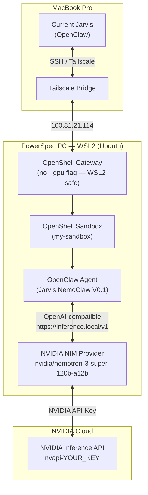
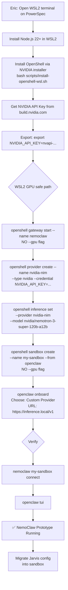

# Project Ajax — NemoClaw Prototype Install Guide
**Created:** 2026-04-12 | **Target:** PowerSpec PC (Windows 11, RTX 5080) → Ajax later
**Status:** Ready to execute — Eric installs NemoClaw today

---

## ⚠️ Critical Facts Before You Start

1. **NemoClaw is alpha** (released March 16, 2026). APIs and config will change. This is a prototype — not production. That's fine for our purposes.
2. **Known WSL2 + NVIDIA GPU bug:** The standard `nemoclaw onboard` command FAILS on Windows WSL2 with NVIDIA GPUs. Do NOT use it. Use the manual CPU-safe path below instead.
3. **ANTHROPIC_API_KEY conflict:** If this env var is set in your shell, NemoClaw silently routes to Anthropic instead of NVIDIA. We'll handle this explicitly.
4. **We're running on PowerSpec first** (100.81.21.114) as the prototype machine — same Windows 11 + WSL2 + Docker Desktop + RTX 5080 stack as Ajax will have.

---

## Architecture Diagrams

### What We're Building (Prototype)



### Install Flow



---

## Step-by-Step: What Eric Does Today

### Prerequisites on PowerSpec (already done from prior setup)
- ✅ Windows 11 Home 25H2
- ✅ WSL2 installed
- ✅ Docker Desktop 29.3.1 with WSL2 backend
- ✅ NVIDIA Driver 32.0.15.9597 (CUDA 13.2)
- ✅ Ubuntu in WSL2 (docker-desktop distro exists)

**One thing to verify:** You need a proper Ubuntu WSL2 distro (not just docker-desktop).
In PowerShell, run: `wsl --list --verbose` — if you only see docker-desktop, install Ubuntu:
```powershell
wsl --install -d Ubuntu-24.04
```

---

### Step 1 — Get your NVIDIA API Key (5 min, Eric does this on any browser)

1. Go to **https://build.nvidia.com/nemoclaw**
2. Sign in with your NVIDIA account (or create a free one)
3. Click **"Get API Key"** → copy the `nvapi-XXXX...` key
4. Keep it handy — you'll paste it in Step 4

---

### Step 2 — Open WSL2 Ubuntu terminal on PowerSpec

Via RDP or SSH into PowerSpec, then open WSL2:
```powershell
# In PowerShell on PowerSpec:
wsl -d Ubuntu-24.04
```

Or via SSH from MacBook:
```bash
ssh "Eric Brown@100.81.21.114"
# Then inside PowerSpec:
wsl -d Ubuntu-24.04
```

---

### Step 3 — Install Node.js 22+ in WSL2 Ubuntu

```bash
# Check if Node.js 22+ is already there
node --version

# If not (or version < 22), install via nvm:
curl -o- https://raw.githubusercontent.com/nvm-sh/nvm/v0.40.2/install.sh | bash
source ~/.bashrc
nvm install 22
nvm use 22
node --version  # should show v22.x.x
```

---

### Step 4 — Install NemoClaw CLI

```bash
# Install via the official NVIDIA script
curl -fsSL https://www.nvidia.com/nemoclaw.sh | bash

# If nemoclaw not found after install:
source ~/.bashrc
nemoclaw --version
```

---

### Step 5 — Set your NVIDIA API key

```bash
export NVIDIA_API_KEY=nvapi-YOUR_KEY_HERE
# Also add to ~/.bashrc so it persists:
echo 'export NVIDIA_API_KEY=nvapi-YOUR_KEY_HERE' >> ~/.bashrc

# CRITICAL: Unset Anthropic key if present (prevents silent routing conflict)
unset ANTHROPIC_API_KEY
# Verify it's gone:
echo $ANTHROPIC_API_KEY  # should print nothing
```

---

### Step 6 — Start OpenShell Gateway (WSL2 safe — NO --gpu flag)

```bash
# This is the critical WSL2 workaround — do NOT add --gpu
openshell gateway start --name nemoclaw

# Verify it started:
openshell gateway status
# Should show: running
```

---

### Step 7 — Configure NVIDIA inference provider

```bash
openshell provider create \
  --name nvidia-nim \
  --type nvidia \
  --credential NVIDIA_API_KEY=$NVIDIA_API_KEY

# Set the model (Nemotron 3 Super — NVIDIA's best reasoning model):
openshell inference set \
  --provider nvidia-nim \
  --model nvidia/nemotron-3-super-120b-a12b

# Verify:
openshell inference list
```

---

### Step 8 — Create the sandbox (NO --gpu flag)

```bash
# Create sandbox without --gpu (WSL2 GPU passthrough is broken in k3s)
openshell sandbox create \
  --name my-sandbox \
  --from openclaw

# Wait ~2 minutes for sandbox to pull and start (~2.4GB image)
# Check status:
openshell sandbox status my-sandbox
# Should show: ready
```

---

### Step 9 — Onboard OpenClaw inside the sandbox

```bash
# Connect to sandbox shell
nemoclaw my-sandbox connect

# Inside the sandbox, run onboard:
openclaw onboard

# When prompted for model provider, choose:
# → "Custom Provider"
# → URL: https://inference.local/v1
# (This is OpenShell's internal OpenAI-compatible endpoint)
# → Do NOT choose Anthropic or enter an Anthropic key here

# Follow the rest of the wizard to completion
```

---

### Step 10 — Verify it's working

```bash
# Still inside the sandbox:
openclaw agent --agent main --local -m "hello, are you running on NemoClaw?" --session-id test

# Expected: A response from Nemotron 3 Super confirming it's running

# Or open the full TUI:
openclaw tui
```

---

### Step 11 — Quick smoke test

```bash
# Test that OpenShell sandbox isolation works:
openclaw agent --agent main --local -m "what files can you see in your workspace?" --session-id test

# Expected: Only files inside the sandbox — NOT your full WSL2 home directory
# This confirms OpenShell sandboxing is working
```

---

## What To Do When It's Running — Tell Jarvis

Once NemoClaw is up and you've verified the smoke test, **message me** with:
> "NemoClaw is running on PowerSpec"

I'll then:
1. SSH into PowerSpec and copy the Jarvis workspace config into the NemoClaw sandbox
2. Re-run `openclaw onboard` inside the sandbox with the full agent config
3. Set up the Claude API key (corporate) inside the sandbox environment
4. Wire up Tailscale so NemoClaw is accessible from MacBook
5. Test the CIC tab connecting to both MacBook OpenClaw AND PowerSpec NemoClaw

---

## Known Issues & Troubleshooting

| Problem | Cause | Fix |
|---------|-------|-----|
| `nemoclaw onboard` hangs / sandbox never ready | WSL2 GPU passthrough bug in k3s | Use manual path above (Step 6-9) — skip `nemoclaw onboard` entirely |
| `nemoclaw: command not found` | PATH not updated | Run `source ~/.bashrc` or open new terminal |
| Responses come from Claude/Anthropic | `ANTHROPIC_API_KEY` set in shell | `unset ANTHROPIC_API_KEY` then restart sandbox |
| Docker OOM during sandbox image pull | <8GB RAM available | Add 8GB swap: `sudo fallocate -l 8G /swapfile && sudo chmod 600 /swapfile && sudo mkswap /swapfile && sudo swapon /swapfile` |
| `openshell gateway status` shows stopped | Gateway crashed | `openshell gateway start --name nemoclaw` again |
| Sandbox image pull timeout | Slow network | Run `openshell sandbox create` again — it resumes |

---

## After Prototype Validated — What Changes for Real Ajax

| Item | PowerSpec Prototype | Real Ajax (Cohesity network) |
|------|--------------------|-----------------------------|
| OS | Windows 11 Home | Windows 11 Pro (domain-joined) |
| GPU flag | No --gpu (WSL2 bug) | May work natively — test with --gpu first |
| API key | Personal NVIDIA key | Corporate NVIDIA enterprise key |
| Claude | Personal key | Corporate Claude API key |
| Slack | N/A | Corporate Slack MCP server |
| Network | Tailscale | Static Cohesity IP + VPN |
| Users | Eric only | Eric + Kathir (RBAC) |
| Logging | Basic | Full Logger Agent + 12mo retention |

---

## Time Estimate

| Step | Time |
|------|------|
| Get NVIDIA API key | 5 min |
| WSL2 + Node.js check/install | 5-10 min |
| NemoClaw install | 5 min |
| OpenShell setup (Steps 6-8) | 10-15 min (mostly waiting for image pull) |
| OpenClaw onboard in sandbox | 5 min |
| Smoke test + verify | 5 min |
| **Total** | **~35-45 min** |

---

## Skill to Create After This Works

Once the prototype is validated, I'll create a `nemoclaw` AgentSkill so future sessions know exactly how to manage the NemoClaw instance (connect, status, logs, restart, migrate config).
