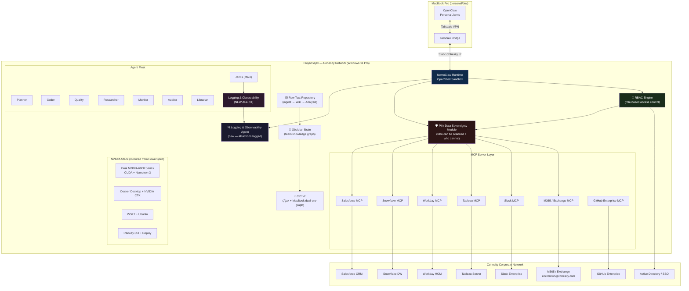
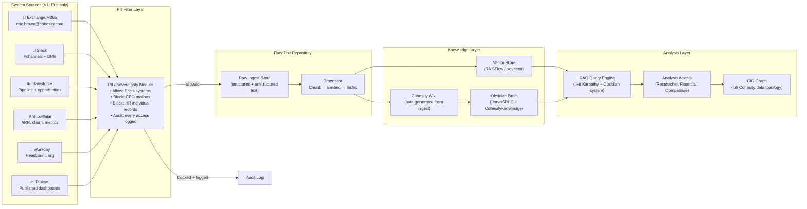
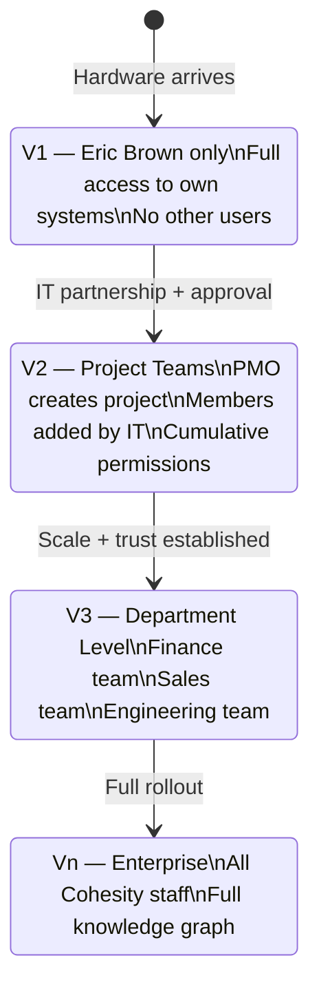
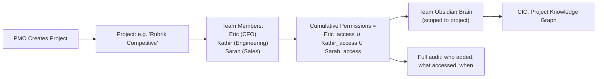
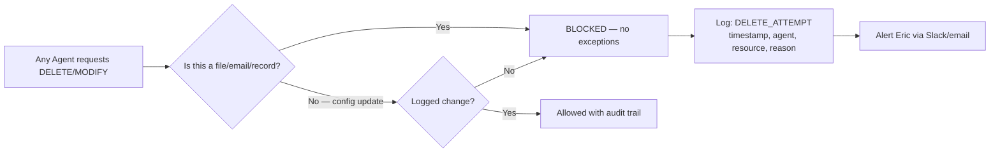

# PROJECT AJAX — Full System Design
**Created:** 2026-04-12 | **Status:** Design v1 | **Author:** Jarvis (Opus 4.6)  
**Named after:** HMS Ajax — British cruiser that crippled the *Admiral Graf Spee* at the Battle of the River Plate, 1939

---

## Overview

Project Ajax is a high-performance, enterprise-grade AI productivity and development server deployed inside the Cohesity corporate network. It runs Jarvis NemoClaw with full access to Cohesity enterprise systems (M365, Salesforce, Snowflake, Workday, Slack, Tableau) under strict role-based access control, comprehensive observability logging, and PII/data sovereignty protection.

**V1 scope:** Eric Brown (`eric.brown@cohesity.com`) only — full system access  
**V2+ scope:** Expand to project teams via IT partnership, cumulative permission model

---

## System Architecture



---

## Data Flow — Ingest to Analysis



---

## RBAC Model — V1 → V∞



### V1 Permission Set (Eric Brown only)

| System | Access Level | Scope |
|--------|-------------|-------|
| Exchange/M365 | Read/Write | `eric.brown@cohesity.com` mailbox only |
| Slack | Read (all channels Eric is in) | No DMs without explicit permission |
| Salesforce | Read (full CRM) | Eric's deals + all pipeline visibility |
| Snowflake | Read (all schemas Eric has access to) | ARR, churn, NRR, headcount metrics |
| Workday | Read (org + headcount) | No individual salary data |
| Tableau | Read (published dashboards) | Same access as Eric's browser session |
| GitHub Enterprise | Read/Write | Eric's repos + Cohesity org repos |
| File System | Read/Write | Eric's Windows home dir + project dirs |

### Permanently Blocked (all versions)

| Rule | Reason |
|------|--------|
| CEO mailbox (`aroop.roy@cohesity.com` or equivalent) | Executive privilege |
| CFO/CLO/CHRO if not Eric | C-suite protection |
| HR individual compensation records | Legal/privacy |
| Board materials marked CONFIDENTIAL | Fiduciary duty |
| Any file/email tagged `PRIVILEGED` or `ATTORNEY-CLIENT` | Legal protection |
| Any system Ajax does NOT have a logged MCP connection to | Zero implicit access |

### V2 Project Team Model (Future)



---

## Logging & Observability Agent (New — MANDATORY)

This is a **first-class new agent** (`agentId: logger`). Every action Ajax takes goes through this agent.

### What Gets Logged (everything)

```
timestamp | agent | action_type | system | resource_id | resource_type | 
user_context | pii_check_result | allowed/blocked | duration_ms | output_hash
```

### Log Categories

| Category | Examples | Retention |
|----------|---------|-----------|
| `data_access` | Email read, Slack read, Snowflake query | 90 days |
| `data_write` | Email sent, file created, Slack post | 1 year |
| `agent_spawn` | Planner spawned, Coder dispatched | 30 days |
| `pii_block` | CEO email access attempt blocked | 1 year |
| `auth_event` | Login, token refresh, permission grant | 1 year |
| `system_change` | Config updated, agent modified | Forever |
| `delete_attempt` | **ANY delete attempt — ALWAYS blocked + logged** | Forever |

### The No-Delete Rule (ABSOLUTE)



**Hard rule: Ajax NEVER deletes or modifies any file, email, record, or data it did not create itself in the current session. Every write is append-only or new-file-only.**

### Daily Observability Report

Every morning at 6 AM, Logger Agent produces:
- Systems accessed in last 24h (by category)
- Data volume ingested
- PII blocks triggered (count + category, never content)
- Any anomalies or rule violations
- Who else (if V2+) accessed what systems

---

## PII / Data Sovereignty Module

### Scan Allow/Block Matrix (V1)

| Person/System | Email | Slack | Files | Calendar |
|--------------|-------|-------|-------|---------|
| Eric Brown | ✅ Full | ✅ Full | ✅ Full | ✅ Full |
| CEO | ❌ BLOCKED | ❌ BLOCKED | ❌ BLOCKED | ❌ BLOCKED |
| Other C-Suite | ❌ BLOCKED | ⚠️ Public channels only | ❌ BLOCKED | ❌ BLOCKED |
| Direct reports to Eric | ⚠️ Requires explicit consent | ⚠️ Public channels only | ❌ BLOCKED | ❌ BLOCKED |
| All Cohesity employees | ❌ BLOCKED | ⚠️ Public channels only | ❌ BLOCKED | ❌ BLOCKED |
| External parties (customers/vendors) | ❌ BLOCKED | N/A | ❌ BLOCKED | ❌ BLOCKED |

### PII Detection Rules
- SSN, credit card, passport numbers → **auto-redact before storage**
- Salary/compensation data → **blocked at MCP layer**
- Medical/health information → **blocked at MCP layer**
- Personal contact info of non-consenting individuals → **stripped**
- Attorney-client privileged content → **blocked, flagged to Eric**

---

## Raw Text Repository → Wiki → Analysis Pipeline

This is the Karpathy/Obsidian pattern applied to Cohesity enterprise data.

### Phase 1: Ingest
- M365 emails → raw `.eml` files → chunked text
- Slack messages → JSON export → threaded text
- Salesforce records → JSON → structured text
- Snowflake query results → CSV → markdown tables
- Workday reports → JSON → org charts + headcount tables
- Tableau → screenshot + data extract → markdown summary

### Phase 2: Process
- Chunk → 512-token segments with overlap
- Embed → `text-embedding-3-large` or Nemotron embeddings (local GPU)
- Index → pgvector in PostgreSQL (already running in ContractAnalyzer stack)
- Wiki generation → one Obsidian `.md` per entity (person, deal, project, metric)

### Phase 3: Knowledge Graph (Obsidian)
- Every entity gets a note with wikilinks to related entities
- Deal → links to → Company, Contact, Competitor, Quarter
- Project → links to → Team Members, Systems, Timeline, Budget
- Person → links to → Role, Org, Projects, Interactions (no private info)
- CIC tab shows the full Cohesity knowledge graph

### Phase 4: Analysis
- RAGFlow queries against the vector store
- Natural language Q&A: "What's the pipeline coverage for Q3?"
- Competitive analysis: "What are Rubrik's Q1 wins in FSI?"
- Financial: "Show me NRR trend by segment for last 4 quarters"

---

## Hardware & Software Stack

### Hardware (ordered)
- **RAM:** 1TB total
- **GPU:** Dual NVIDIA 6000-series (ADA Lovelace or RTX 6000 Ada — 48GB VRAM each = 96GB total)
- **OS:** Windows 11 Pro
- **Network:** Static Cohesity IP, inside corporate firewall

### Software Stack (mirror PowerSpec exactly)

| Component | Version | Source |
|-----------|---------|--------|
| Windows 11 Pro | 25H2 | Cohesity IT |
| WSL2 + Ubuntu 24.04 | Latest | Microsoft |
| Docker Desktop | 29.x | Cohesity IT approved |
| NVIDIA Driver | Latest stable | NVIDIA |
| CUDA Toolkit | 13.x | NVIDIA |
| NVIDIA Container Toolkit | Latest | NVIDIA |
| NemoClaw | Latest | NVIDIA Enterprise |
| Python | 3.12 | Standard |
| Node.js | 24.x | Standard |
| Git | Latest | Standard |
| GitHub CLI | Latest | Standard |
| Railway CLI | Latest | Railway |
| OpenSSH Server | Built-in | Windows |
| Tailscale | Latest | Tailscale |

### Remote Access
- **Primary:** Windows Remote Desktop (RDP) via Cohesity VPN
- **Development:** SSH (OpenSSH) for Kathir + approved developers
- **Jarvis remote:** Tailscale (same setup as PowerSpec)
- **MacBook bridge:** Tailscale VPN → static Cohesity IP

---

## Remote Developer Access (Kathir + others)

### Access Levels

| Role | Person | SSH | RDP | Agent Control | Data Access |
|------|--------|-----|-----|---------------|------------|
| Owner | Eric Brown | ✅ Full | ✅ Full | ✅ Full | ✅ All |
| Senior Dev | Kathir | ✅ Project dirs only | ✅ Limited | ⚠️ Coder/Tester only | ⚠️ Project-scoped |
| IT Admin | Cohesity IT | ✅ Admin | ✅ Admin | ❌ None | ❌ None |

### Developer Rules
- All SSH sessions logged by Logger Agent
- No access to Eric's email, Slack, or personal data
- Project directories only — no access to `~/` home
- All agent spawns require explicit task ID in Logger
- Code review before any production agent changes

---

## Migration from PowerSpec / MacBook

### What Migrates to Ajax

| Component | Migrate? | Notes |
|-----------|---------|-------|
| All SKILL.md files | ✅ Full copy | Platform-agnostic |
| All AGENTS.md/RULES.md | ✅ Full copy | Platform-agnostic |
| DELEGATION.md, PIPELINE.md | ✅ Full copy | Platform-agnostic |
| memory/ files | ✅ Full copy | Personal context |
| plans/ | ✅ Full copy | Architecture docs |
| scripts/ | ✅ Full copy | Need path adjustments |
| openclaw.json | ⚠️ Adapted | NemoClaw config format |
| Docker containers | ✅ Re-deploy | FinancialReportApp, ContractAnalyzer |
| Mission Control | ✅ Re-deploy | New URL/IP |
| CIC tab | ✅ Re-deploy | Shows Ajax + MacBook topology |
| Google OAuth tokens | ❌ Re-auth | Browser re-auth on Ajax |
| Anthropic API key | ✅ Copy to env | Corporate Claude account |
| Tailscale | ✅ New device | Add Ajax to tailnet |
| voice-call skill | ⚠️ Reconfigure | New Funnel URL |

### Skills Needing Ajax-Specific Config

| Skill | Change Needed |
|-------|--------------|
| `gog` / Google OAuth | Re-auth with `eric.brown@cohesity.com` credentials |
| `salesforce-analytics` | Use Ajax MCP server instead of REST API |
| `snowflake-sql` | Update connection string to Cohesity Snowflake |
| `workday-analytics` | Configure Cohesity Workday endpoint |
| `slack-teams-hub` | Use Cohesity Slack workspace token |
| `himalaya` / email | Configure for Exchange/M365 |
| `voice-call` | New Tailscale Funnel URL |
| All new MCP skills | Build per enterprise system above |

---

## New Agents Required for Ajax

| Agent | Purpose | Priority |
|-------|---------|---------|
| `logger` — Logging & Observability | Audit trail for ALL actions | 🔴 Must-have V1 |
| `pii-guardian` — Data Sovereignty | Enforce allow/block matrix | 🔴 Must-have V1 |
| `ingester` — Raw Text Ingest | Ingest enterprise data to raw store | 🟡 V1.5 |
| `wiki-builder` — Knowledge Builder | Raw text → Obsidian wiki | 🟡 V1.5 |
| `rbac-manager` — Access Control | Manage user permissions | 🟡 V2 |
| `project-brain` — Team Knowledge | Per-project Obsidian brain | 🟢 V2 |

---

## V1 Build Sequence (After Hardware Arrives)

### Day 0 — Hardware setup (IT + Eric)
1. Windows 11 Pro clean install (Cohesity IT)
2. Static IP assignment + firewall rules
3. RDP + SSH enabled
4. Join Cohesity AD domain

### Day 1 — Foundation (Jarvis remote from MacBook)
5. Install WSL2 + Ubuntu 24.04
6. Install Docker Desktop + NVIDIA CTK
7. Install NVIDIA drivers (mirror PowerSpec stack exactly)
8. Install NemoClaw (NVIDIA enterprise license)
9. Install Node, Python, Git, Railway CLI
10. Install Tailscale → add to tailnet → verify MacBook can SSH in

### Day 2 — Jarvis Migration
11. Run snapshot on MacBook: `tar -czf jarvis_ajax_v1_snapshot.tar.gz ~/.openclaw/`
12. Upload to Dropbox: `/Jarvis Backups/ajax-v1/`
13. Transfer to Ajax and restore
14. Re-auth all credentials (Google OAuth, Anthropic, GitHub)
15. Deploy Mission Control + CIC tab
16. Verify all agents respond

### Day 3 — Enterprise Integrations
17. Configure M365 MCP server (Exchange access)
18. Configure Salesforce MCP server
19. Configure Snowflake MCP server
20. Configure Workday MCP (read-only)
21. Configure Slack MCP
22. Test each integration with Logger Agent running
23. Verify PII blocks work (attempt CEO mailbox access → should log + block)

### Day 4 — Logger & PII
24. Deploy Logger Agent (`agentId: logger`)
25. Deploy PII Guardian module
26. Set up allow/block matrix per spec above
27. Run 24h observability test — review morning report
28. Eric reviews + approves

### Day 5 — Raw Text Repository
29. Deploy pgvector database
30. Build ingester for M365 emails (last 30 days)
31. Build Obsidian wiki generator (Cohesity entities)
32. Deploy RAGFlow on Ajax GPU
33. Test: "What's the pipeline for next quarter?"

---

## Open Questions for Eric

1. **NVIDIA License:** Is this through Cohesity's NVIDIA enterprise agreement, or personal purchase? NemoClaw requires NVIDIA enterprise license for full SOC 2 features.
2. **IT partnership:** Who is the Cohesity IT contact for Ajax setup? We'll need them for AD join, firewall rules, and MCP server credentials.
3. **Corporate Claude:** Is this the Team/Enterprise plan via SSO, or a separate API key? Affects how the Anthropic client is configured.
4. **Kathir's access:** SSH key to provision, and what specific projects should his access be scoped to initially?
5. **CEO block list:** Confirm the CEO's email address so we can hardcode the block rule correctly from day one.
6. **Data retention:** What's Cohesity's data retention policy for AI-generated logs? Affects the Logger Agent retention table above.
7. **Slack access:** Bot token vs user token for Eric's workspace access? User token gives full DM visibility; bot token is scoped.

---

## Adversarial Review Notes (Self-Review)

**Risks flagged:**
- `[HIGH]` NemoClaw Linux-only at launch — Ajax is Windows 11 Pro. Need to confirm NemoClaw runs natively on Windows or requires WSL2. Mitigation: run NemoClaw inside WSL2/Docker container.
- `[HIGH]` Static Cohesity IP means Ajax is on-prem, not cloud. All MCP servers need to work from inside the corporate firewall. VPN/proxy config required for external APIs.
- `[MED]` No-delete rule conflicts with agent autonomy model. Need to enforce at the MCP layer (read-only tokens where possible) not just in agent instructions.
- `[MED]` 1TB RAM + dual 6000 series is overkill for current workloads — but right-sized for future team expansion and local LLM inference.
- `[LOW]` Windows Remote Desktop + SSH gives two attack surfaces. Recommend disabling RDP and using SSH-only for non-Eric users.
